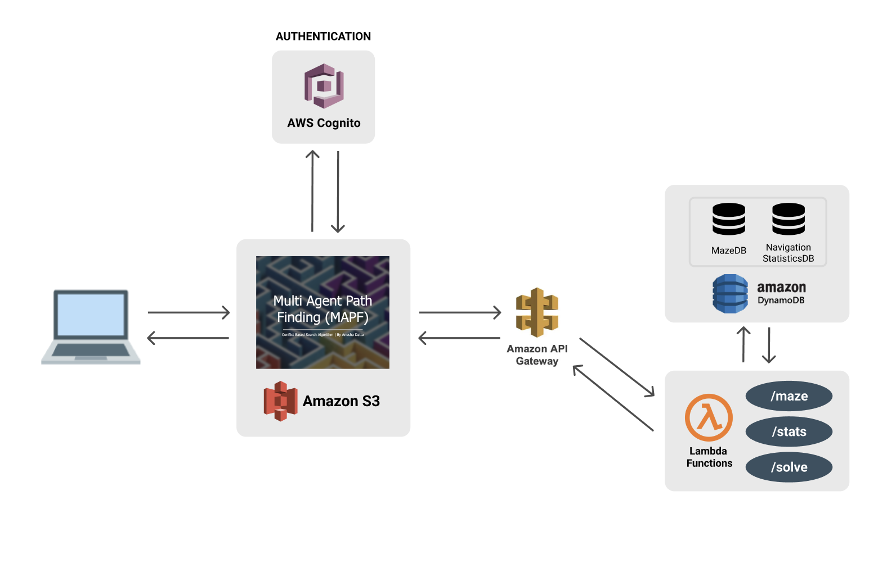

# Multi Agent Path Finding 

> SCSE21-0115 Final Year Project, Supervised by Dr. Xueyan Tang \
> School of Computer Science and Engineering \
> Nanyang Technological University

Multi Agent Path Finding (MAPF) is the computational problem of constructing collision-free paths for a set of agents from their respective start to goal positions within a given maze. In recent years, MAPF has gained increasing importance as it is central to many large-scale robotic applications, from logistic distribution systems to simultaneous localization and mapping. Over time, numerous approaches to MAPF have emerged, one of which is the Conflict Based Search (CBS) Algorithm. 

### Conflict Based Search 

Conflict Based Search is a dual level algorithm. At the high level, CBS performs search on a binary constraint tree. While at the lower level, it performs a search for a single agent at a time. In most cases, this reformulation enables CBS to examine fewer states than a global A* based approached, while still maintaining optimality. 

In this project, Conflict Based Search (CBS) Algorithm, with A* Search as the lower level search algorithm, is the employed approach to solve the Multi Agent Path Finding problem. The insights of this approach are augmented with additional experimentation on search performances of different lower level search heuristics: Manhattan Distance, Chebyshev Distance & Euclidean Distance.

### MAPF: Cloud Driven Implementation

This project also includes the design, development and deployment of a cloud driven MAPF application. This offers features including authentication differentiation, maze generation algorithms, interactive MAPF functionalities to visualize agent path traversal, and a navigation statistics pipeline that record statistical navigation parameters such as execution cost and execution time of the same. This extends the practical advantage of strong predictive insights and perceptible navigation trends. 

For further reference, refer to the final presentation slide deck [here](https://github.com/anushadatta/MAPF/blob/main/front-end/assets/MAPF.pdf).
